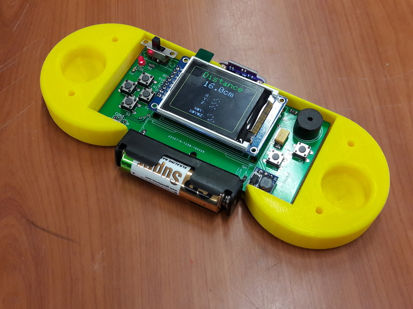

# BG-Modul

Unterlagen zum Produkt-Modul am Bismarck-Gymnasium.



Dieses Repository enthält die Schaltpläne und Platinenunterlagen
als PDF und im Original-Eagle-Format. Die Dateien können mit der
Test-Version von Eagle geöffnet werden.

Das Demo-Program bgmeter.ino kann in der Arduino-IDE geöffnet
werden. Es benötigt als zusätzliche Bibliotheken

  - ```VL53L0X distance sensor library``` von Pololu für den Laser-Sensor
  - ```TFT_ST7735 library``` von Bodmer für das Display

In der Datei ```User_Setup.h``` der TFT_ST7735-Bibliothek müssen
folgenden Zeilen angepasst werden, damit korrekt eingestellt ist an
welchen Anschlüssen des Prozessors das Display angeschlossen ist:

```
// ###### EDIT THE PIN NUMBERS IN THE 3 LINES FOLLOWING TO SUIT YOUR SETUP ######

#define TFT_CS  10  // Chip select control pin
#define TFT_DC  8  // Data Command control pin
#define TFT_RST 9  // Reset pin (could connect to Arduino RESET pin)
```

